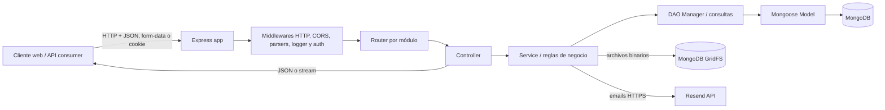
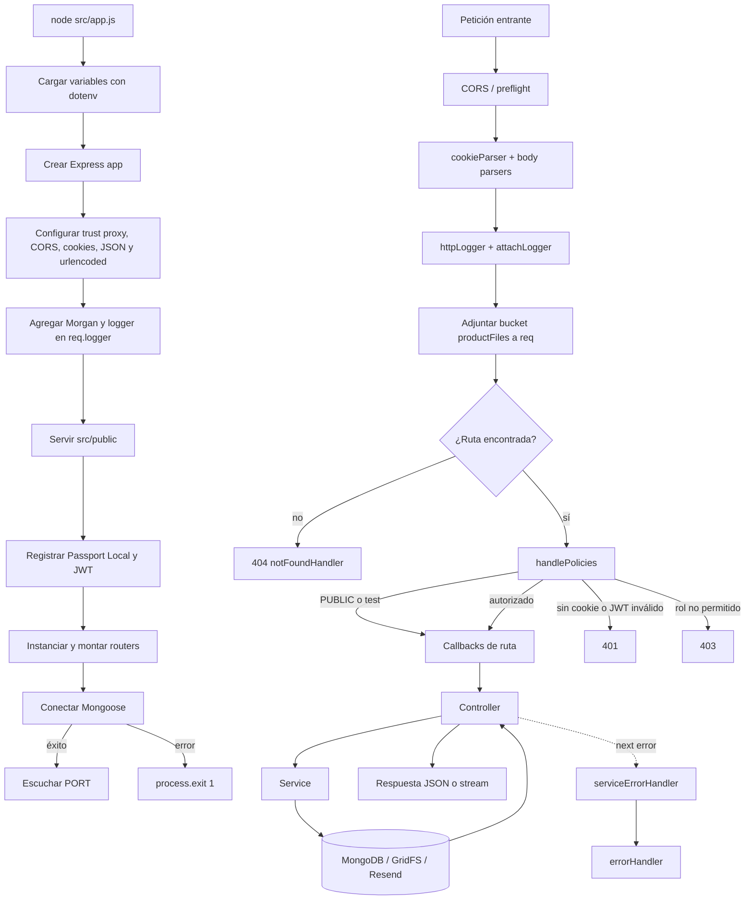
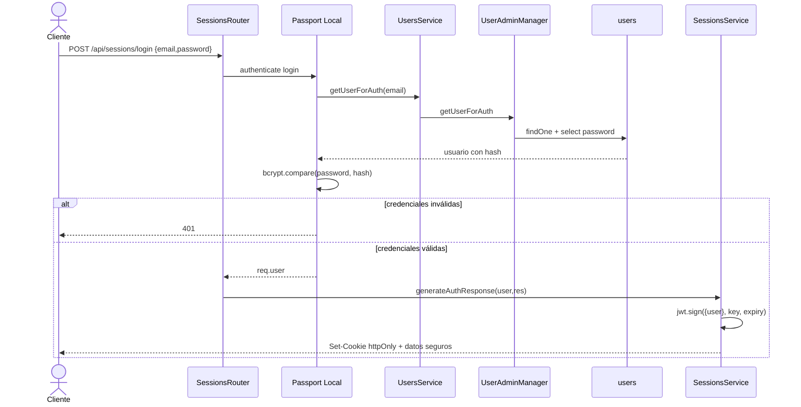
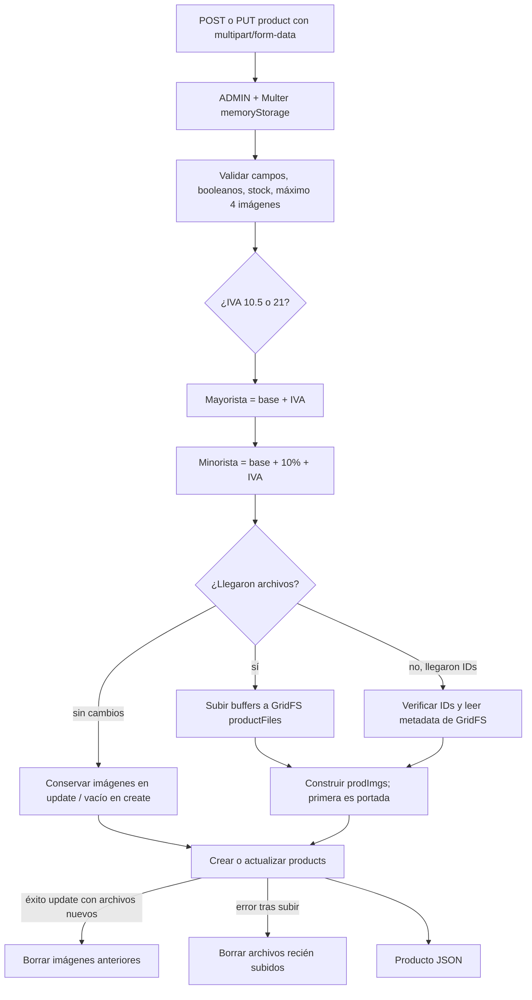
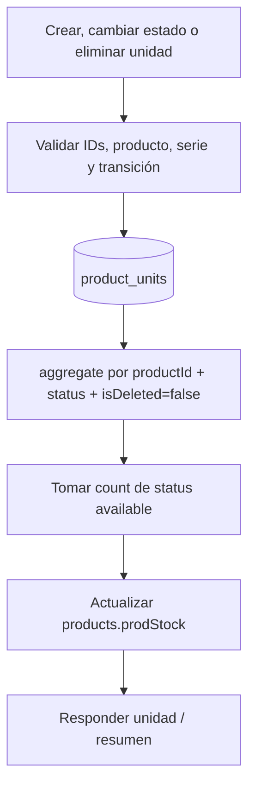
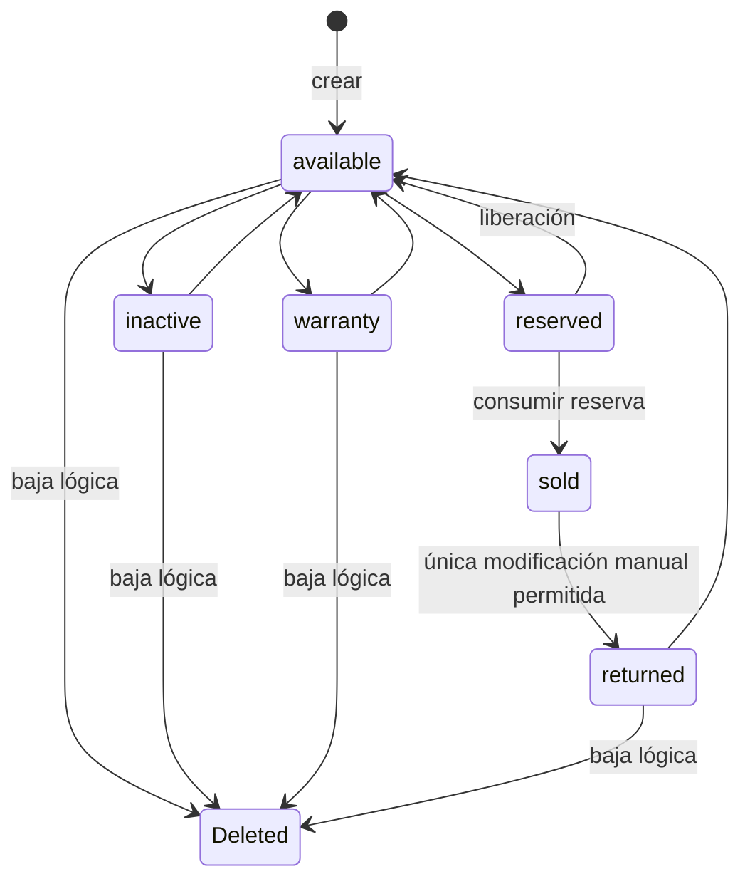
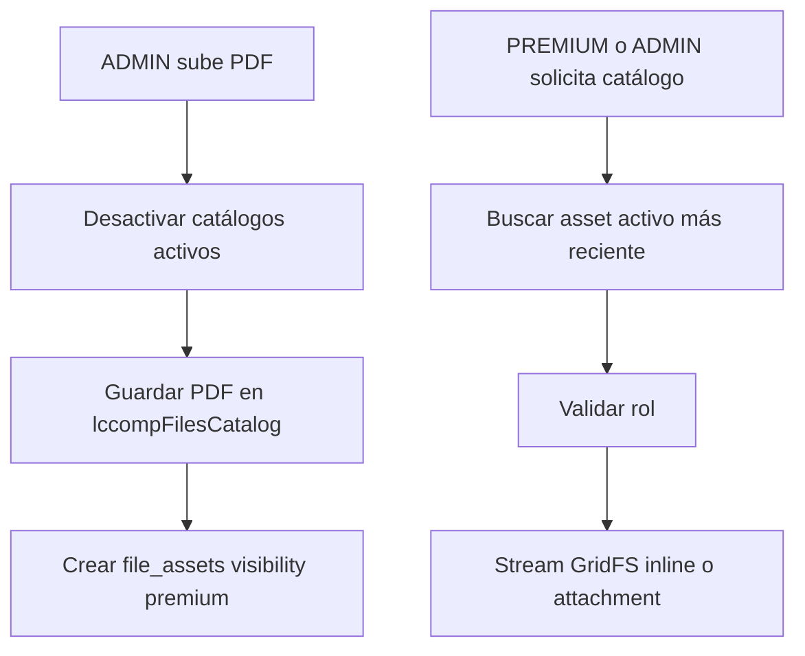
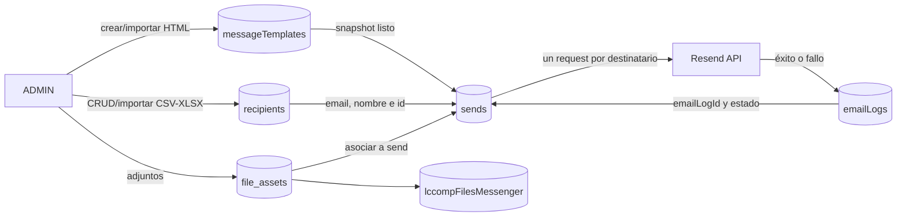
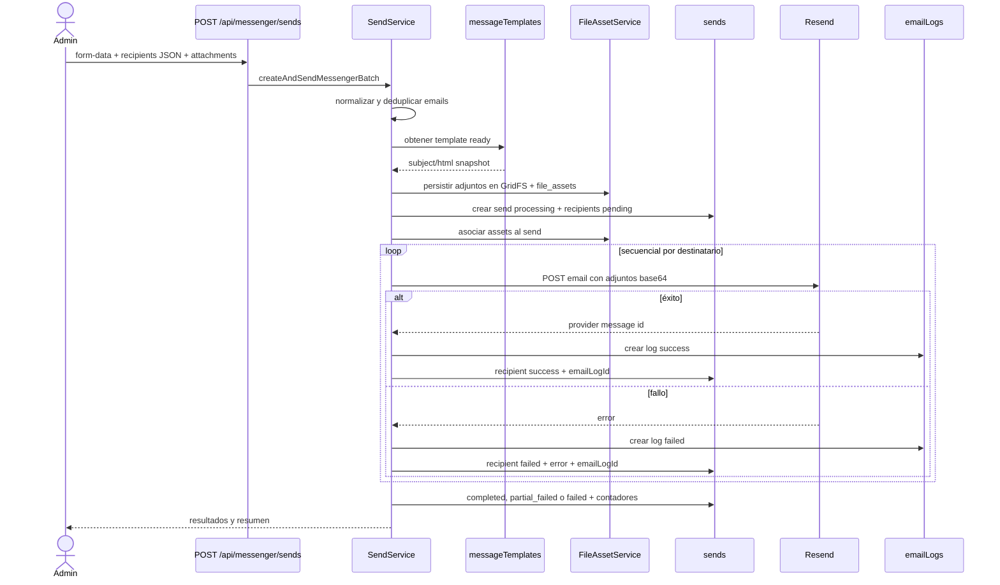
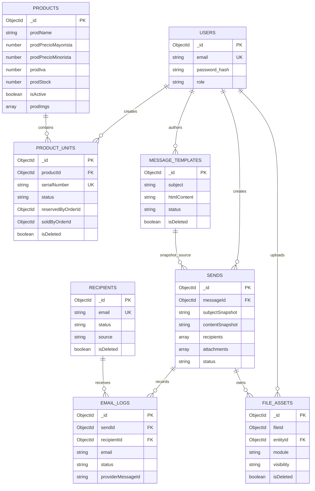

# Arquitectura y flujo de datos de BackLcComp

Este documento describe el flujo que está conectado actualmente desde `src/app.js`. Distingue el camino activo del código heredado que existe en el repositorio pero no participa en ninguna ruta.

## 1. Vista general

La aplicación es una API REST monolítica en Node.js con Express y MongoDB/Mongoose. La organización predominante es por capas:



No todos los módulos respetan la capa DAO de igual manera: productos y unidades acceden a modelos Mongoose directamente desde el servicio en algunas operaciones. Por eso la arquitectura real es una combinación de `Controller-Service-DAO` y Active Record de Mongoose.

## 2. Arranque y pipeline de cada petición



Orden efectivo de middlewares globales:

1. CORS y `OPTIONS`.
2. Cookies, JSON y formularios URL encoded.
3. Logging HTTP y `req.logger`.
4. Archivos estáticos.
5. Inicialización de Passport.
6. Inyección opcional de `req.gfsBucket`.
7. Routers de negocio.
8. 404, errores de `UsersService` y errores generales.

`MyOwnRouter` aplica `handlePolicies` y envuelve cada callback en `applyCallbacks`. Los controladores normalmente usan `next(err)`; una excepción que escape directamente del callback es contestada por el wrapper como HTTP 500.

## 3. Mapa de módulos y endpoints

| Prefijo              | Endpoint                             |                 Política | Flujo principal                                        |
| -------------------- | ------------------------------------ | -----------------------: | ------------------------------------------------------ |
| `/api/sessions`      | `POST /login`                        |                   PUBLIC | Passport Local → UsersService → bcrypt → JWT cookie    |
|                      | `GET /current`                       |       USER/ADMIN/PREMIUM | JWT cookie → usuario actual → MongoDB                  |
|                      | `POST /logout`                       |       USER/ADMIN/PREMIUM | eliminar cookie                                        |
| `/api/users`         | `GET /`                              |                    ADMIN | Controller → UsersService → UserAdminManager → users   |
|                      | `POST /register`                     |                    ADMIN | validar → bcrypt → crear user                          |
|                      | `PUT /role/:id`                      |                    ADMIN | validar rol → actualizar user                          |
|                      | `DELETE /:id`                        |                    ADMIN | eliminación física de user                             |
| `/api/products`      | `GET /`, `GET /:id`                  |                   PUBLIC | ProductsService → products                             |
|                      | `POST /`, `PUT /:id`                 |                    ADMIN | Multer → precios/IVA → GridFS `productFiles` → product |
|                      | `DELETE /:id`                        |                    ADMIN | baja física o `isActive=false`; imágenes opcionales    |
| `/api/product-units` | `GET /product/:productId`            |                    ADMIN | unidades + resumen por estado                          |
|                      | `POST /product/:productId`           |                    ADMIN | crear serie → recalcular stock                         |
|                      | `POST /product/:productId/bulk`      |                    ADMIN | normalizar/deduplicar → insertar → recalcular stock    |
|                      | `PUT /:unitId/status`                |                    ADMIN | transición de estado → recalcular stock                |
|                      | `DELETE /:unitId`                    |                    ADMIN | baja lógica → recalcular stock                         |
| `/api/checkout`      | `POST /`                             |             USER/PREMIUM | checkout local idempotente → Order MP → checkout URL   |
| `/api/files`         | `GET /:id`                           |                   PUBLIC | stream directo desde `productFiles`                    |
|                      | `GET /info/:id`, `DELETE /:id`       |                    ADMIN | metadata o borrado de `productFiles`                   |
| `/api/file-assets`   | catálogo, upload, view, entity, list | PREMIUM/ADMIN según ruta | registro `file_assets` + bucket por módulo             |
| `/api/messenger`     | `/recipients...`                     |                    ADMIN | CRUD/importación CSV-XLSX de recipients                |
|                      | `/messages...`                       |                    ADMIN | CRUD/importación HTML de messageTemplates              |
|                      | `/sends...`                          |                    ADMIN | crear/reintentar/listar envíos                         |
|                      | `/email-logs...`                     |                    ADMIN | consultar auditoría de emails                          |

Nota: en `['PUBLIC', 'ADMIN']` sólo se evalúa la primera política para decidir que la ruta es pública. Por tanto `GET /api/products` es público; `ADMIN` en esa lista no agrega una restricción.

## 4. Autenticación y autorización



En rutas protegidas, `handlePolicies` lee la cookie, ejecuta `jwt.verify`, extrae `decoded.user`, permite siempre a `SUPERADMIN` y compara el rol con las políticas requeridas. La estrategia Passport JWT se registra, pero ninguna ruta llama a `passport.authenticate('jwt')`; la verificación activa es la implementación manual de `handlePolicies`.

En `NODE_ENV=test`, todas las políticas se omiten.

## 5. Productos, imágenes e inventario serializado

### Crear o actualizar un producto



Las imágenes del producto no tienen documento `file_assets`; su metadata queda embebida en `products.prodImgs` y el binario vive en los collections GridFS `productFiles.files` y `productFiles.chunks`.

### Unidades y stock derivado



Estados de una unidad:



Los métodos de reserva, liberación y venta vinculados a `orders` se consumen internamente desde los servicios de Commerce. No existen endpoints manuales para reservar unidades ni marcarlas como vendidas.

## 6. Archivos

Existen dos subsistemas distintos:

```mermaid
flowchart LR
    subgraph ProductImages[Imágenes de productos]
        ProductAPI[/api/products]
        FileAPI[/api/files]
        ProductService[ProductsService + FileService]
        ProductBucket[(GridFS productFiles)]
        Products[(products.prodImgs)]
        ProductAPI --> ProductService
        FileAPI --> ProductService
        ProductService --> ProductBucket
        ProductService --> Products
    end

    subgraph ManagedAssets[Assets administrados]
        AssetAPI[/api/file-assets]
        Messenger[/api/messenger/sends]
        AssetService[FileAssetService]
        Registry[(file_assets)]
        ModuleBuckets[(GridFS buckets por módulo)]
        AssetAPI --> AssetService
        Messenger --> AssetService
        AssetService --> Registry
        AssetService --> ModuleBuckets
    end
```

Buckets de assets: `lccompFilesCatalog`, `lccompFilesMessenger`, `lccompFilesQuote`, `lccompFilesBilling` y `lccompFilesGeneral`.

El documento `file_assets` funciona como registro de metadata y autorización: enlaza `fileId` físico, módulo, entidad, visibilidad, usuario, expiración y estado lógico. El acceso premium permite `PREMIUM` y `ADMIN`; el privado sólo `ADMIN`; el modo token actualmente retorna acceso verdadero sin comprobar el token en `canAccessAsset`.

Flujo de catálogo:



## 7. Messenger: plantillas, destinatarios, envíos y logs



### Envío individual o masivo



El envío persiste una copia del asunto y HTML (`subjectSnapshot`, `contentSnapshot`). Así, cambios posteriores en la plantilla no alteran el historial. El reintento toma sólo destinatarios fallidos, reconstruye adjuntos leyendo GridFS, crea nuevos logs `messenger_send_retry` y recalcula contadores.

La importación de destinatarios carga el archivo completo en memoria, parsea CSV simple o la primera hoja XLSX, normaliza emails, rechaza duplicados del archivo o de MongoDB y devuelve un resumen de creados/rechazados.

## 8. Modelo de datos y relaciones



MongoDB no aplica integridad referencial entre estas referencias. Las relaciones son convenciones de Mongoose y deben mantenerse desde los servicios.

## 9. Patrones utilizados

| Patrón                                 | Implementación en el proyecto                                      |
| -------------------------------------- | ------------------------------------------------------------------ |
| Layered architecture                   | Router → Controller → Service → Manager/Model                      |
| Front controller / middleware pipeline | `app.js` centraliza políticas transversales antes de las rutas     |
| Repository/DAO                         | clases `*.manager.js` encapsulan queries de varias colecciones     |
| Active Record                          | servicios de productos/unidades usan directamente modelos Mongoose |
| Template Method / router base          | `MyOwnRouter` estandariza verbos, políticas y wrappers             |
| RBAC                                   | políticas por roles con JWT en cookie                              |
| Soft delete                            | recipients, templates, product units y file assets                 |
| Snapshot / audit log                   | sends conserva contenido; emailLogs conserva cada resultado        |
| State machine implícita                | estados de unidades, sends, recipients y templates                 |
| Compensating action                    | rollback de imágenes nuevas si falla crear/actualizar producto     |
| Registry + blob storage                | `file_assets` registra metadata y GridFS guarda binarios           |
| Singleton/caché de infraestructura     | instancias de GridFSBucket guardadas globalmente o en un Map       |

## 10. Código presente pero fuera del flujo activo

- `src/conect.js`: helper de conexión no importado; `app.js` conecta directamente.
- `service.mailing.js`: servicio alternativo de mailing no importado.
- `messengerMessage.model.js` y `messengerMessage.mongo.js`: variante anterior; las rutas actuales usan `messageTemplate`.
- `SendService.createAndSendMessengerEmail`: método individual heredado; el controller llama al método batch incluso para un destinatario.
- `req.gfsBucket` creado en `app.js`: los controladores usan `FileService.ensureBucket`, no esta propiedad.
- Estrategia Passport JWT: registrada pero no consumida por rutas.
- Métodos de reserva/consumo de unidades por orden: preparados en DAO, sin flujo HTTP conectado.

## 11. Riesgos y puntos de atención

1. Hay dos clases `ServiceError`. El mapper global reconoce sólo la exportada por `services.users.js`. Además, `ProductsService` guarda el HTTP status en `err.status`, mientras `errorHandler` lee `err.statusCode`; varios errores de producto previstos como 400/404 pueden terminar como 500.
2. `products.prodStock` puede recibirse manualmente al crear/actualizar, pero también se recalcula desde unidades disponibles. Son dos fuentes de verdad y pueden divergir.
3. El borrado físico de un producto no valida ni elimina sus `product_units`; puede dejar referencias huérfanas.
4. El upload genérico guarda primero en GridFS y después crea `file_assets`; si falla el segundo paso no hay rollback del binario.
5. Al subir un catálogo se desactiva el anterior antes de confirmar que el nuevo PDF se guardó. Un fallo puede dejar el sistema sin catálogo activo.
6. El envío masivo es secuencial y ocurre dentro de la petición HTTP. Con muchos destinatarios puede exceder timeouts; no hay cola, worker ni idempotency key.
7. Un fallo después de persistir adjuntos pero antes de crear/asociar el send puede dejar assets huérfanos.
8. La visibilidad `token` no valida un token real en `canAccessAsset`.
9. El wrapper base puede responder 500 directamente a excepciones y evita que el middleware global aplique un formato único en esos casos.
10. Los tests cubren sólo usuarios y llaman `POST /api/users`, pero la ruta activa de alta es `POST /api/users/register`; hay desalineación entre contrato y tests.
11. `app.js` conecta y ejecuta `listen` al importarse, lo que mezcla construcción de la app con bootstrap y dificulta pruebas aisladas.
12. Las respuestas no usan un contrato único: conviven `status/data`, `success/data`, `payload` y `error`.

## 12. Lectura rápida del flujo completo

Para seguir una petición concreta en el código, el orden recomendado es:

1. Buscar el prefijo en `src/app.js`.
2. Abrir el router correspondiente y verificar política y uploader.
3. Seguir el controller para ver params/body/query y forma de respuesta.
4. Seguir el service para validaciones, reglas, estados y efectos secundarios.
5. Revisar manager y model para query, filtros de baja lógica, índices y referencias.
6. Si hay archivos, identificar si usa `productFiles` o `FileAssetService`.
7. Si es Messenger, continuar hasta `send.service.js`, Resend, `emailLogs` y actualización de `sends`.
